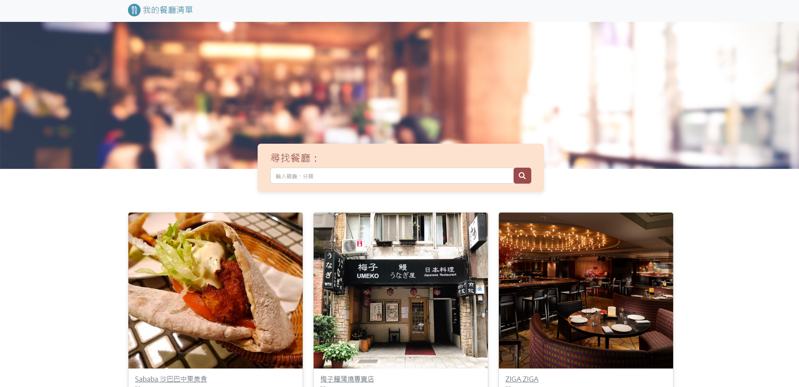

# 美食私藏名單
一個使用Node.js與Express建置的美食私藏清單網站

## Feature - 功能
+ 使用者可於主頁面瀏覽所有餐廳的名稱、分類與評分
+ 使用者可於主頁面透過關鍵字查找餐廳名稱或分類
+ 使用者可於主頁面點擊餐廳，以檢視詳細資料
  + 詳細資料包含類別、地址、電話及簡述

## 專案畫面
  
 
  
 
    
 
## Development Environment - 開發環境
+ Node.js @16.17.1 - 執行環境
+ Express @4.16.4 - 應用程式架構
+ Handlerbars @3.0.0 - 模板引擎

## Installing - 安裝流程
1. 打開終端機，Clone專案至本機
<pre><code>git clone https://github.com/Yuwen-ctw/Restarunt-List.git</code></pre>
2. 進入專案資料夾
<pre><code>cd Restarunt-List</code></pre>
3. 安裝npm套件
<pre><code>npm install</code></pre>
4. 啟動專案
<pre><code>npm run start</code></pre>
>or 開發者模式(需有 nodemon 套件)
<pre><code>npm run dev</code></pre>

